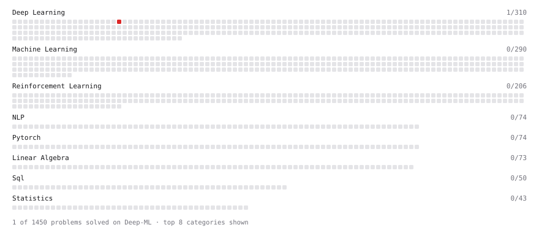

# Deep-ML

My machine learning practice from [Deep-ML](https://www.deep-ml.com). Every solution here was written by hand.

**5** solved · 5 problems · 0 labs · 0 math

[**Browse the interactive portfolio**](https://Tranbac123.github.io/deep-ml/) to replay this filling in over time.

## Problems

| | Difficulty | Solved | |
| --- | --- | --- | --- |
| [Implement a Simple Residual Block with Shortcut Connection](https://www.deep-ml.com/problems/113) | easy | 2026-09-27 | [solution](problems/0113-implement-a-simple-residual-block-with-shortcut-connection) |
| [Implement Masked Self-Attention](https://www.deep-ml.com/problems/107) | medium | 2026-09-26 | [solution](problems/0107-implement-masked-self-attention) |
| [Implement Position-wise Feed-Forward Block with Residual and Dropout](https://www.deep-ml.com/problems/178) | medium | 2026-09-28 | [solution](problems/0178-implement-position-wise-feed-forward-block-with-residual-and-dropout) |
| [Implement Multi-Head Attention](https://www.deep-ml.com/problems/94) | hard | 2026-09-26 | [solution](problems/0094-implement-multi-head-attention) |
| [Positional Encoding Calculator](https://www.deep-ml.com/problems/85) | hard | 2026-09-27 | [solution](problems/0085-positional-encoding-calculator) |

---

_This file is regenerated by Deep-ML on every push._
